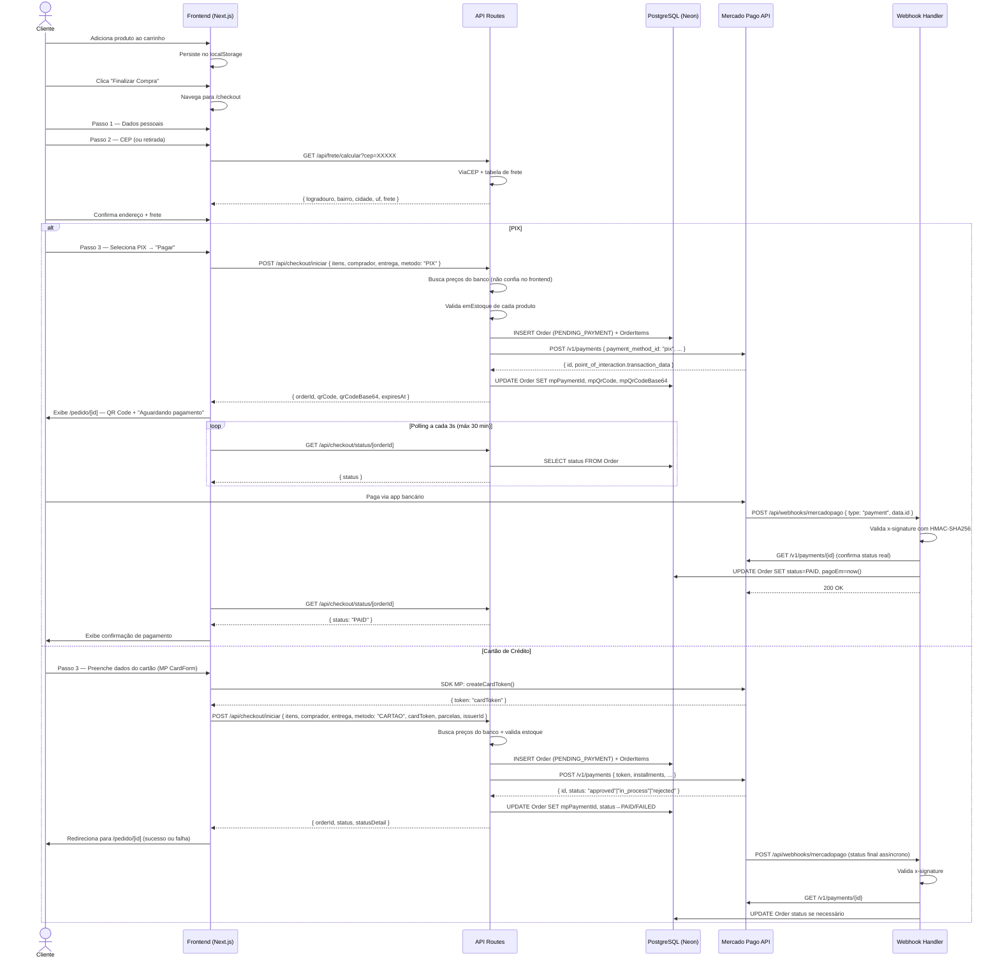

# CART.md — PRD: Fluxo Completo de Compras + Mercado Pago
## Ekomart — Supermercado Online

> **Destinatário:** Gemini Pro (implementação completa)
> **Data:** 2026-05-09
> **Status:** Aprovado para implementação

---

## 1. Visão Geral

Implementar o fluxo completo de compra do Ekomart: desde a persistência do carrinho até a confirmação assíncrona de pagamento via webhook do Mercado Pago. O checkout é **anônimo** (sem login de cliente), aceita **PIX e Cartão de Crédito**, com opção de **entrega (CEP) ou retirada em loja**.

---

## 2. Contexto do Projeto

### Stack
- **Framework:** Next.js 16.2.6 com App Router + Turbopack
- **Linguagem:** TypeScript 6
- **ORM:** Prisma 5.16.2 + PostgreSQL (Neon)
- **Estilos:** Tailwind CSS 4
- **Auth (admin):** JWT via `jose` — cookie `admin-token`
- **Storage:** Vercel Blob
- **Deploy:** Vercel (domínio: `digitalgen.vercel.app`)

### Convenções do Projeto
- O middleware chama-se `src/proxy.ts` e exporta `proxy` (não `middleware`) — isso é uma convenção do projeto, **não alterar**
- Route groups: `(public)/` para páginas públicas, `admin/(protected)/` para admin
- IDs: CUID (`@default(cuid())`)
- Preço: `Decimal @db.Decimal(10,2)` no Prisma, `number` no TypeScript de frontend
- Utilitário de moeda: `formatarMoeda()` em `src/utils/formatadores.ts` — já existe, reutilizar
- Ícones: `lucide-react` — já instalado

### Arquivos Relevantes Existentes
```
src/
  models/produto.model.ts          # Interfaces: Produto, Categoria, ItemCarrinho
  viewmodels/carrinho.vm.ts        # Estado global do carrinho (a migrar)
  utils/formatadores.ts            # formatarMoeda(), etc.
  utils/validators.ts              # Validações (adicionar CPF aqui)
  proxy.ts                         # Middleware JWT — protege /admin/** e /api/admin/**
  app/
    (public)/
      carrinho/page.tsx            # Página do carrinho (ajustar)
    admin/
      (protected)/                 # Painel admin
prisma/
  schema.prisma                    # Schema atual (adicionar models)
```

### Estrutura Atual do Schema Prisma
```prisma
model Produto {
  id               String   @id @default(cuid())
  nome             String
  preco            Decimal  @db.Decimal(10, 2)
  precoOriginal    Decimal? @db.Decimal(10, 2)
  imagem           String
  imagens          String[] @default([])
  quantidadePacote String
  emEstoque        Boolean  @default(true)
  // ... outros campos
}
// Models existentes: Admin, Categoria, Produto, Tag, ProdutoTag, Secao, SecaoItem
```

---

## 3. Escopo desta Feature

- [x] Migrar carrinho de memória global para `localStorage`
- [x] Ajustar página `/carrinho` (remover impostos ficticios, remover cupom)
- [x] Criar página `/checkout` com stepper 3 etapas
- [x] API `POST /api/checkout/iniciar` (cria Order + chama Mercado Pago)
- [x] API `GET /api/frete/calcular?cep=` (ViaCEP + tabela de frete)
- [x] API `GET /api/checkout/status/[orderId]` (polling status)
- [x] API `POST /api/webhooks/mercadopago` (confirmação assíncrona)
- [x] Página `/pedido/[id]` (confirmação / aguardando PIX)
- [x] Tela admin básica de pedidos `/admin/pedidos`

## 4. Fora do Escopo

- Autenticação de cliente (checkout é anônimo)
- Cupons de desconto
- Boleto bancário
- Variações de produto
- Histórico de pedidos para o cliente
- Cancelamento/estorno automatizado
- Cálculo de frete por API externa (usar tabela por região — MVP)

---

## 5. Pré-requisitos

### 5.1 Instalar Dependências

```bash
npm install mercadopago @mercadopago/sdk-react
```

> **Versão alvo:** `mercadopago@^2` (SDK Node.js oficial v2)
> **`@mercadopago/sdk-react`:** componentes React do MP (CardForm, initMercadoPago)

### 5.2 Credenciais Mercado Pago (Sandbox)

Estas são as credenciais de **teste**. Nunca commitá-las — usar apenas via `.env.local`.

```
PUBLIC_KEY (Sandbox):  TEST-39f27907-c949-4388-9047-ac41eef92490
ACCESS_TOKEN (Sandbox): TEST-4312985170785669-050912-8ebe07a9399202ec56dbe501c005bc43-2901116807
```

Para obter o `MP_WEBHOOK_SECRET`:
1. Acesse: Mercado Pago → Desenvolvedores → Webhooks
2. Adicione a URL: `https://digitalgen.vercel.app/api/webhooks/mercadopago`
3. Selecione o evento: `payment`
4. Copie o **Webhook Secret** gerado pelo painel
5. Coloque em `MP_WEBHOOK_SECRET`

---

## 6. Variáveis de Ambiente

### `.env.local` (desenvolvimento)
```bash
# Banco (já existe)
DATABASE_URL="..."

# JWT Admin (já existe)
JWT_SECRET="..."

# ─── Mercado Pago Sandbox ─────────────────────────────────────────────────
MP_ACCESS_TOKEN="TEST-4312985170785669-050912-8ebe07a9399202ec56dbe501c005bc43-2901116807"
NEXT_PUBLIC_MP_PUBLIC_KEY="TEST-39f27907-c949-4388-9047-ac41eef92490"
MP_WEBHOOK_SECRET=""         # preencher após registrar webhook no painel MP

# ─── Frete ───────────────────────────────────────────────────────────────
# Valor em reais. Lógica real usa tabela por região (ver seção 11).
FRETE_GRATIS_ACIMA="200"     # subtotal mínimo para frete grátis (em reais)

# ─── App ─────────────────────────────────────────────────────────────────
NEXT_PUBLIC_APP_URL="http://localhost:3000"  # em produção: https://digitalgen.vercel.app

# ─── Loja (endereço para retirada) ───────────────────────────────────────
NEXT_PUBLIC_LOJA_ENDERECO="Rua Example, 100 — São Paulo, SP"
NEXT_PUBLIC_LOJA_HORARIO="Seg–Sex 8h–20h · Sáb 8h–18h"
```

### Vercel — adicionar no painel (Settings → Environment Variables)
```
MP_ACCESS_TOKEN          (servidor)
MP_WEBHOOK_SECRET        (servidor)
NEXT_PUBLIC_MP_PUBLIC_KEY (público)
NEXT_PUBLIC_APP_URL      (público)
FRETE_GRATIS_ACIMA       (servidor)
NEXT_PUBLIC_LOJA_ENDERECO (público)
NEXT_PUBLIC_LOJA_HORARIO  (público)
```

---

## 7. Diagrama de Sequência



---

## 8. Estados do Pedido

```
PENDING_PAYMENT  → Pedido criado, aguardando confirmação de pagamento
PROCESSING       → Webhook recebido, validando com MP (estado transitório)
PAID             → Pagamento confirmado pelo webhook/MP API
FAILED           → Pagamento recusado ou erro
CANCELLED        → Cancelado manualmente pelo admin
```

Transições válidas:
```
PENDING_PAYMENT → PROCESSING → PAID
PENDING_PAYMENT → PROCESSING → FAILED
PENDING_PAYMENT → CANCELLED  (admin)
```

**Regra de idempotência:** Nunca atualizar um Order que já está em `PAID` ou `FAILED`.

---

## 9. Implementação — Passo 0: Preparação

### 9.1 Adicionar ao `.gitignore`
```
.env.local
```

### 9.2 Criar arquivo de constantes de frete

**Criar:** `src/lib/frete.ts`
```typescript
// Tabela de frete por região (MVP — substituir por Melhor Envio futuramente)
const FRETE_POR_REGIAO: Record<string, number> = {
  // Sudeste
  SP: 10, RJ: 12, MG: 12, ES: 14,
  // Sul
  RS: 14, SC: 13, PR: 12,
  // Centro-Oeste
  DF: 16, GO: 16, MT: 18, MS: 17,
  // Nordeste
  BA: 18, SE: 19, AL: 20, PE: 20, PB: 21, RN: 21, CE: 20, PI: 22, MA: 22,
  // Norte
  PA: 24, AM: 28, RO: 26, AC: 30, RR: 30, AP: 28, TO: 22,
};
const FRETE_PADRAO = 20;

export function calcularFretePorUF(uf: string): number {
  return FRETE_POR_REGIAO[uf.toUpperCase()] ?? FRETE_PADRAO;
}
```

### 9.3 Criar cliente Prisma singleton

**Criar:** `src/lib/prisma.ts` (se ainda não existir)
```typescript
import { PrismaClient } from '@prisma/client';

const globalForPrisma = globalThis as unknown as { prisma: PrismaClient };

export const prisma =
  globalForPrisma.prisma ?? new PrismaClient({ log: ['error'] });

if (process.env.NODE_ENV !== 'production') globalForPrisma.prisma = prisma;
```

> Se já existir um arquivo com o cliente Prisma no projeto, usar o existente.

---

## 10. Implementação — Passo 1: Schema Prisma

### 10.1 Adicionar ao `prisma/schema.prisma`

Inserir **ao final do arquivo**, antes do fechamento:

```prisma
// ─── Enums de Pedido ──────────────────────────────────────────────────────────

enum OrderStatus {
  PENDING_PAYMENT
  PROCESSING
  PAID
  FAILED
  CANCELLED
}

enum MetodoPagamento {
  PIX
  CARTAO
}

enum EntregaTipo {
  ENTREGA
  RETIRADA
}

// ─── Pedido ───────────────────────────────────────────────────────────────────

model Order {
  id                String          @id @default(cuid())
  status            OrderStatus     @default(PENDING_PAYMENT)

  // Comprador anônimo — coletado no checkout
  compradorNome     String
  compradorEmail    String
  compradorCpf      String
  compradorTelefone String

  // Entrega
  entregaTipo       EntregaTipo
  cep               String?
  logradouro        String?
  numero            String?
  complemento       String?
  bairro            String?
  cidade            String?
  uf                String?

  // Valores — SEMPRE calculados no backend
  subtotal          Decimal         @db.Decimal(10,2)
  frete             Decimal         @db.Decimal(10,2) @default(0)
  total             Decimal         @db.Decimal(10,2)

  // Mercado Pago
  metodoPagamento   MetodoPagamento?
  mpPaymentId       String?         @unique
  mpStatus          String?         // status bruto retornado pelo MP
  mpQrCode          String?         @db.Text  // PIX: código copia-e-cola
  mpQrCodeBase64    String?         @db.Text  // PIX: imagem base64

  criadoEm         DateTime        @default(now())
  atualizadoEm     DateTime        @updatedAt
  pagoEm           DateTime?

  items            OrderItem[]

  @@index([status])
  @@index([compradorEmail])
  @@index([mpPaymentId])
}

// ─── Item do Pedido ───────────────────────────────────────────────────────────

model OrderItem {
  id            String   @id @default(cuid())
  orderId       String
  order         Order    @relation(fields: [orderId], references: [id], onDelete: Cascade)
  produtoId     String
  produto       Produto  @relation(fields: [produtoId], references: [id])

  // Snapshot — valores congelados no momento da compra
  nomeProduto   String
  imagemProduto String
  preco         Decimal  @db.Decimal(10,2)
  quantidade    Int
  subtotal      Decimal  @db.Decimal(10,2)

  @@index([orderId])
}
```

### 10.2 Adicionar relação no model `Produto`

No model `Produto` existente, adicionar dentro das relações:
```prisma
  orderItems  OrderItem[]
```

### 10.3 Rodar migration

```bash
npx prisma migrate dev --name add_orders
npx prisma generate
```

---

## 11. Implementação — Passo 2: Tipos TypeScript

### 11.1 Criar `src/models/checkout.model.ts`

```typescript
export interface DadosComprador {
  nome: string;
  email: string;
  cpf: string;        // formato: apenas dígitos "12345678901"
  telefone: string;   // apenas dígitos "11999999999"
}

export interface DadosEntrega {
  tipo: 'ENTREGA' | 'RETIRADA';
  cep?: string;
  logradouro?: string;
  numero?: string;
  complemento?: string;
  bairro?: string;
  cidade?: string;
  uf?: string;
}

export interface ItemCheckout {
  produtoId: string;
  quantidade: number;
}

export interface CheckoutIniciarPayload {
  itens: ItemCheckout[];
  comprador: DadosComprador;
  entrega: DadosEntrega;
  metodo: 'PIX' | 'CARTAO';
  // Cartão apenas:
  cardToken?: string;
  parcelas?: number;
  issuerId?: string;
}

export interface CheckoutIniciarResponse {
  orderId: string;
  metodo: 'PIX' | 'CARTAO';
  status: string;
  // PIX:
  qrCode?: string;
  qrCodeBase64?: string;
  expiresAt?: string;
  // Cartão:
  statusDetail?: string;
}

export interface FreteResponse {
  logradouro: string;
  bairro: string;
  cidade: string;
  uf: string;
  frete: number;
  freteGratis: boolean;
}
```

### 11.2 Adicionar validação de CPF em `src/utils/validators.ts`

```typescript
export function validarCPF(cpf: string): boolean {
  const digits = cpf.replace(/\D/g, '');
  if (digits.length !== 11) return false;
  if (/^(\d)\1+$/.test(digits)) return false;

  let sum = 0;
  for (let i = 0; i < 9; i++) sum += parseInt(digits[i]) * (10 - i);
  let check = (sum * 10) % 11;
  if (check === 10 || check === 11) check = 0;
  if (check !== parseInt(digits[9])) return false;

  sum = 0;
  for (let i = 0; i < 10; i++) sum += parseInt(digits[i]) * (11 - i);
  check = (sum * 10) % 11;
  if (check === 10 || check === 11) check = 0;
  return check === parseInt(digits[10]);
}

export function formatarCPF(cpf: string): string {
  const d = cpf.replace(/\D/g, '').slice(0, 11);
  return d.replace(/(\d{3})(\d{3})(\d{3})(\d{2})/, '$1.$2.$3-$4');
}

export function formatarTelefone(tel: string): string {
  const d = tel.replace(/\D/g, '').slice(0, 11);
  if (d.length === 11) return d.replace(/(\d{2})(\d{5})(\d{4})/, '($1) $2-$3');
  return d.replace(/(\d{2})(\d{4})(\d{4})/, '($1) $2-$3');
}
```

---

## 12. Implementação — Passo 3: Migrar Carrinho para localStorage

### 12.1 Substituir `src/viewmodels/carrinho.vm.ts` completamente

```typescript
'use client';

import { useState, useEffect, useCallback } from 'react';
import { ItemCarrinho, Produto } from '../models/produto.model';

const STORAGE_KEY = 'ekomart:carrinho';

function lerStorage(): ItemCarrinho[] {
  if (typeof window === 'undefined') return [];
  try {
    const raw = localStorage.getItem(STORAGE_KEY);
    return raw ? JSON.parse(raw) : [];
  } catch {
    return [];
  }
}

function salvarStorage(itens: ItemCarrinho[]) {
  if (typeof window === 'undefined') return;
  localStorage.setItem(STORAGE_KEY, JSON.stringify(itens));
}

// Pub/sub para sincronizar entre hooks na mesma aba
let listeners: Array<() => void> = [];
const notificar = () => listeners.forEach(l => l());

export function useCarrinhoViewModel() {
  const [itens, setItens] = useState<ItemCarrinho[]>([]);

  // Hidratação no cliente
  useEffect(() => {
    setItens(lerStorage());

    const listener = () => setItens(lerStorage());
    listeners.push(listener);

    // Sincronizar entre abas
    const onStorage = (e: StorageEvent) => {
      if (e.key === STORAGE_KEY) setItens(lerStorage());
    };
    window.addEventListener('storage', onStorage);

    return () => {
      listeners = listeners.filter(l => l !== listener);
      window.removeEventListener('storage', onStorage);
    };
  }, []);

  const subtotal = itens.reduce((acc, item) => acc + item.produto.preco * item.quantidade, 0);
  const limiteFreteGratis = parseFloat(process.env.NEXT_PUBLIC_FRETE_GRATIS_ACIMA ?? '200');
  const freteEstimado = subtotal >= limiteFreteGratis ? 0 : 15;
  const total = subtotal + freteEstimado;

  const adicionarItem = useCallback((produto: Produto, quantidade = 1) => {
    if (!produto.emEstoque) return;
    const itensAtuais = lerStorage();
    const idx = itensAtuais.findIndex(i => i.produto.id === produto.id);
    if (idx >= 0) {
      itensAtuais[idx].quantidade += quantidade;
    } else {
      itensAtuais.push({ produto, quantidade });
    }
    salvarStorage(itensAtuais);
    notificar();
  }, []);

  const removerItem = useCallback((produtoId: string) => {
    const novos = lerStorage().filter(i => i.produto.id !== produtoId);
    salvarStorage(novos);
    notificar();
  }, []);

  const atualizarQuantidade = useCallback((produtoId: string, quantidade: number) => {
    const itensAtuais = lerStorage();
    const idx = itensAtuais.findIndex(i => i.produto.id === produtoId);
    if (idx < 0) return;
    if (quantidade <= 0) {
      itensAtuais.splice(idx, 1);
    } else {
      itensAtuais[idx].quantidade = quantidade;
    }
    salvarStorage(itensAtuais);
    notificar();
  }, []);

  const limparCarrinho = useCallback(() => {
    salvarStorage([]);
    notificar();
  }, []);

  return {
    itens,
    quantidadeTotal: itens.reduce((acc, item) => acc + item.quantidade, 0),
    subtotal,
    freteEstimado,
    total,
    adicionarItem,
    removerItem,
    atualizarQuantidade,
    limparCarrinho,
  };
}
```

> **Atenção:** O campo `frete` foi renomeado para `freteEstimado` no hook. Atualizar todos os componentes que desestruturavam `frete` do hook para usar `freteEstimado`.

---

## 13. Implementação — Passo 4: Ajustar Página do Carrinho

### 13.1 Modificar `src/app/(public)/carrinho/page.tsx`

Mudanças necessárias (não reescrever tudo, apenas as diferenças):

1. **Renomear** desestruturação: `frete` → `freteEstimado`
2. **Remover** o bloco de "Impostos est." do resumo (era imposto fictício de 5%)
3. **Remover** o bloco de "Cupom de Desconto" (não haverá cupons)
4. **Trocar** o `<button>Finalizar Compra</button>` por um Link que navega para `/checkout`
5. **Atualizar** o cálculo do total exibido: `subtotal + freteEstimado` (sem impostos)
6. **Remover** "BOLETO" dos selos de pagamento (manter: VISA, MASTER, PIX)
7. **Adicionar** linha de aviso de frete estimado: `"* Frete estimado. Valor final calculado no checkout."`

**Trecho do botão final (substituir o button atual):**
```tsx
import { useRouter } from 'next/navigation';
// ...
const router = useRouter();
// ...
<button
  onClick={() => router.push('/checkout')}
  className="w-full bg-green-600 hover:bg-green-700 text-white font-bold py-3.5 rounded-xl text-base mb-5 shadow-md shadow-green-600/25 transition-all hover:-translate-y-0.5"
>
  Finalizar Compra
</button>
```

**Trecho do resumo (substituir seção de valores):**
```tsx
<div className="space-y-3 mb-5 text-sm">
  <div className="flex justify-between text-gray-600">
    <span>Subtotal</span>
    <span className="font-bold text-gray-900">{formatarMoeda(subtotal)}</span>
  </div>
  <div className="flex justify-between text-gray-600">
    <span>Frete est.*</span>
    <span className="font-bold">
      {freteEstimado === 0
        ? <span className="text-green-600">Grátis</span>
        : <span className="text-gray-900">{formatarMoeda(freteEstimado)}</span>}
    </span>
  </div>
</div>
// ... total:
<span className="text-2xl sm:text-3xl font-black text-green-600">
  {formatarMoeda(subtotal + freteEstimado)}
</span>
// ... após o botão:
<p className="text-[10px] text-gray-400 text-center mt-2">
  * Frete calculado com precisão no checkout
</p>
```

---

## 14. Implementação — Passo 5: API de Frete

### 14.1 Criar `src/app/api/frete/calcular/route.ts`

```typescript
import { NextRequest, NextResponse } from 'next/server';
import { calcularFretePorUF } from '@/src/lib/frete';

export async function GET(req: NextRequest) {
  const cep = req.nextUrl.searchParams.get('cep')?.replace(/\D/g, '');
  const subtotalParam = req.nextUrl.searchParams.get('subtotal');

  if (!cep || cep.length !== 8) {
    return NextResponse.json({ error: 'CEP inválido' }, { status: 400 });
  }

  const viaCepRes = await fetch(`https://viacep.com.br/ws/${cep}/json/`, {
    next: { revalidate: 3600 },
  });

  if (!viaCepRes.ok) {
    return NextResponse.json({ error: 'Erro ao consultar CEP' }, { status: 502 });
  }

  const dados = await viaCepRes.json();

  if (dados.erro) {
    return NextResponse.json({ error: 'CEP não encontrado' }, { status: 404 });
  }

  const subtotal = subtotalParam ? parseFloat(subtotalParam) : 0;
  const limiteFreteGratis = parseFloat(process.env.FRETE_GRATIS_ACIMA ?? '200');
  const freteGratis = subtotal >= limiteFreteGratis;
  const frete = freteGratis ? 0 : calcularFretePorUF(dados.uf ?? '');

  return NextResponse.json({
    logradouro: dados.logradouro ?? '',
    bairro: dados.bairro ?? '',
    cidade: dados.localidade ?? '',
    uf: dados.uf ?? '',
    frete,
    freteGratis,
  });
}
```

---

## 15. Implementação — Passo 6: Página de Checkout

### 15.1 Criar `src/app/(public)/checkout/page.tsx`

Esta é a página principal do checkout. Implementar como **Client Component** (`'use client'`).

**Estrutura de arquivo:**
```
src/app/(public)/checkout/
  page.tsx          # componente principal (stepper)
  StepDados.tsx     # passo 1: dados do comprador
  StepEntrega.tsx   # passo 2: tipo de entrega + CEP
  StepPagamento.tsx # passo 3: PIX ou Cartão
  PixQrCode.tsx     # exibição do QR code após submissão PIX
```

### 15.2 `src/app/(public)/checkout/page.tsx`

```tsx
'use client';

import { useState, useEffect } from 'react';
import { useRouter } from 'next/navigation';
import { useCarrinhoViewModel } from '@/src/viewmodels/carrinho.vm';
import { DadosComprador, DadosEntrega } from '@/src/models/checkout.model';
import StepDados from './StepDados';
import StepEntrega from './StepEntrega';
import StepPagamento from './StepPagamento';
import { ChevronRight } from 'lucide-react';

export type CheckoutStep = 1 | 2 | 3;

export default function CheckoutPage() {
  const router = useRouter();
  const { itens, subtotal, limparCarrinho } = useCarrinhoViewModel();
  const [step, setStep] = useState<CheckoutStep>(1);
  const [comprador, setComprador] = useState<DadosComprador | null>(null);
  const [entrega, setEntrega] = useState<DadosEntrega | null>(null);
  const [frete, setFrete] = useState(0);

  // Redireciona se carrinho vazio
  useEffect(() => {
    if (itens.length === 0) router.replace('/carrinho');
  }, [itens, router]);

  if (itens.length === 0) return null;

  const STEPS = [
    { num: 1, label: 'Seus dados' },
    { num: 2, label: 'Entrega' },
    { num: 3, label: 'Pagamento' },
  ];

  return (
    <div className="container mx-auto px-4 max-w-3xl py-8">
      {/* Breadcrumb */}
      <div className="flex items-center gap-1.5 text-xs text-gray-500 mb-6">
        <a href="/" className="hover:text-green-600">Início</a>
        <ChevronRight size={12} />
        <a href="/carrinho" className="hover:text-green-600">Carrinho</a>
        <ChevronRight size={12} />
        <span className="font-medium text-gray-900">Checkout</span>
      </div>

      {/* Stepper */}
      <div className="flex items-center justify-center gap-2 mb-8">
        {STEPS.map((s, idx) => (
          <div key={s.num} className="flex items-center gap-2">
            <div className={`flex items-center gap-2 ${step >= s.num ? 'text-green-600' : 'text-gray-400'}`}>
              <div className={`w-7 h-7 rounded-full flex items-center justify-center text-xs font-bold border-2
                ${step > s.num ? 'bg-green-600 border-green-600 text-white' : ''}
                ${step === s.num ? 'border-green-600 text-green-600' : ''}
                ${step < s.num ? 'border-gray-300 text-gray-400' : ''}
              `}>
                {step > s.num ? '✓' : s.num}
              </div>
              <span className="text-sm font-medium hidden sm:inline">{s.label}</span>
            </div>
            {idx < STEPS.length - 1 && (
              <div className={`h-px w-8 sm:w-16 ${step > s.num ? 'bg-green-600' : 'bg-gray-200'}`} />
            )}
          </div>
        ))}
      </div>

      {/* Steps */}
      {step === 1 && (
        <StepDados
          inicial={comprador}
          onNext={(dados) => { setComprador(dados); setStep(2); }}
        />
      )}
      {step === 2 && (
        <StepEntrega
          subtotal={subtotal}
          inicial={entrega}
          onBack={() => setStep(1)}
          onNext={(dados, freteCalculado) => {
            setEntrega(dados);
            setFrete(freteCalculado);
            setStep(3);
          }}
        />
      )}
      {step === 3 && comprador && entrega && (
        <StepPagamento
          comprador={comprador}
          entrega={entrega}
          itens={itens}
          subtotal={subtotal}
          frete={frete}
          onBack={() => setStep(2)}
          onSuccess={(orderId) => {
            limparCarrinho();
            router.push(`/pedido/${orderId}`);
          }}
        />
      )}
    </div>
  );
}
```

### 15.3 `src/app/(public)/checkout/StepDados.tsx`

```tsx
'use client';

import { useState } from 'react';
import { DadosComprador } from '@/src/models/checkout.model';
import { validarCPF, formatarCPF, formatarTelefone } from '@/src/utils/validators';

interface Props {
  inicial: DadosComprador | null;
  onNext: (dados: DadosComprador) => void;
}

export default function StepDados({ inicial, onNext }: Props) {
  const [form, setForm] = useState<DadosComprador>(inicial ?? {
    nome: '', email: '', cpf: '', telefone: '',
  });
  const [erros, setErros] = useState<Partial<DadosComprador>>({});

  const validar = (): boolean => {
    const e: Partial<DadosComprador> = {};
    if (!form.nome.trim() || form.nome.trim().length < 3) e.nome = 'Nome completo obrigatório';
    if (!/^[^\s@]+@[^\s@]+\.[^\s@]+$/.test(form.email)) e.email = 'E-mail inválido';
    const cpfLimpo = form.cpf.replace(/\D/g, '');
    if (!validarCPF(cpfLimpo)) e.cpf = 'CPF inválido';
    const telLimpo = form.telefone.replace(/\D/g, '');
    if (telLimpo.length < 10) e.telefone = 'Telefone inválido';
    setErros(e);
    return Object.keys(e).length === 0;
  };

  const handleSubmit = (e: React.FormEvent) => {
    e.preventDefault();
    if (!validar()) return;
    onNext({
      nome: form.nome.trim(),
      email: form.email.trim().toLowerCase(),
      cpf: form.cpf.replace(/\D/g, ''),
      telefone: form.telefone.replace(/\D/g, ''),
    });
  };

  const campo = (label: string, key: keyof DadosComprador, type = 'text', placeholder = '') => (
    <div>
      <label className="block text-sm font-bold text-gray-700 mb-1">{label}</label>
      <input
        type={type}
        value={form[key]}
        onChange={e => {
          let v = e.target.value;
          if (key === 'cpf') v = formatarCPF(v);
          if (key === 'telefone') v = formatarTelefone(v);
          setForm(f => ({ ...f, [key]: v }));
          if (erros[key]) setErros(e2 => ({ ...e2, [key]: undefined }));
        }}
        placeholder={placeholder}
        className={`w-full border rounded-xl px-4 py-3 text-sm outline-none transition-colors
          ${erros[key] ? 'border-red-400 focus:border-red-500' : 'border-gray-300 focus:border-green-500'}`}
      />
      {erros[key] && <p className="text-xs text-red-500 mt-1">{erros[key]}</p>}
    </div>
  );

  return (
    <form onSubmit={handleSubmit} className="bg-white rounded-2xl border border-gray-200 p-6 space-y-5">
      <h2 className="text-xl font-extrabold text-gray-900">Seus dados</h2>
      {campo('Nome completo', 'nome', 'text', 'João da Silva')}
      {campo('E-mail', 'email', 'email', 'joao@email.com')}
      {campo('CPF', 'cpf', 'text', '000.000.000-00')}
      {campo('Telefone / WhatsApp', 'telefone', 'tel', '(11) 99999-9999')}
      <button
        type="submit"
        className="w-full bg-green-600 hover:bg-green-700 text-white font-bold py-3.5 rounded-xl transition-colors"
      >
        Continuar para Entrega →
      </button>
    </form>
  );
}
```

### 15.4 `src/app/(public)/checkout/StepEntrega.tsx`

```tsx
'use client';

import { useState } from 'react';
import { DadosEntrega, FreteResponse } from '@/src/models/checkout.model';
import { formatarMoeda } from '@/src/utils/formatadores';
import { MapPin, Store, Loader2 } from 'lucide-react';

interface Props {
  subtotal: number;
  inicial: DadosEntrega | null;
  onBack: () => void;
  onNext: (dados: DadosEntrega, frete: number) => void;
}

export default function StepEntrega({ subtotal, inicial, onBack, onNext }: Props) {
  const [tipo, setTipo] = useState<'ENTREGA' | 'RETIRADA'>(inicial?.tipo ?? 'ENTREGA');
  const [cep, setCep] = useState(inicial?.cep ?? '');
  const [endereco, setEndereco] = useState<FreteResponse | null>(null);
  const [numero, setNumero] = useState(inicial?.numero ?? '');
  const [complemento, setComplemento] = useState(inicial?.complemento ?? '');
  const [buscando, setBuscando] = useState(false);
  const [erroCep, setErroCep] = useState('');

  const buscarCep = async (valor: string) => {
    const limpo = valor.replace(/\D/g, '');
    if (limpo.length !== 8) return;
    setBuscando(true);
    setErroCep('');
    try {
      const res = await fetch(`/api/frete/calcular?cep=${limpo}&subtotal=${subtotal}`);
      if (!res.ok) throw new Error('CEP não encontrado');
      const data: FreteResponse = await res.json();
      setEndereco(data);
    } catch {
      setErroCep('CEP não encontrado. Verifique e tente novamente.');
      setEndereco(null);
    } finally {
      setBuscando(false);
    }
  };

  const handleSubmit = (e: React.FormEvent) => {
    e.preventDefault();
    if (tipo === 'ENTREGA') {
      if (!endereco) { setErroCep('Consulte o CEP primeiro'); return; }
      if (!numero.trim()) return;
      onNext({
        tipo: 'ENTREGA',
        cep: cep.replace(/\D/g, ''),
        logradouro: endereco.logradouro,
        numero: numero.trim(),
        complemento: complemento.trim(),
        bairro: endereco.bairro,
        cidade: endereco.cidade,
        uf: endereco.uf,
      }, endereco.frete);
    } else {
      onNext({ tipo: 'RETIRADA' }, 0);
    }
  };

  const formatCep = (v: string) => {
    const d = v.replace(/\D/g, '').slice(0, 8);
    return d.length > 5 ? d.replace(/(\d{5})(\d)/, '$1-$2') : d;
  };

  return (
    <form onSubmit={handleSubmit} className="bg-white rounded-2xl border border-gray-200 p-6 space-y-5">
      <h2 className="text-xl font-extrabold text-gray-900">Entrega</h2>

      {/* Tipo */}
      <div className="grid grid-cols-2 gap-3">
        {(['ENTREGA', 'RETIRADA'] as const).map(t => (
          <button
            key={t}
            type="button"
            onClick={() => setTipo(t)}
            className={`flex flex-col items-center gap-2 p-4 rounded-xl border-2 transition-colors
              ${tipo === t ? 'border-green-600 bg-green-50' : 'border-gray-200 hover:border-gray-300'}`}
          >
            {t === 'ENTREGA' ? <MapPin size={20} className={tipo === t ? 'text-green-600' : 'text-gray-400'} />
              : <Store size={20} className={tipo === t ? 'text-green-600' : 'text-gray-400'} />}
            <span className={`text-sm font-bold ${tipo === t ? 'text-green-700' : 'text-gray-600'}`}>
              {t === 'ENTREGA' ? 'Receber em casa' : 'Retirar na loja'}
            </span>
            {t === 'RETIRADA' && <span className="text-xs text-green-600 font-bold">Grátis</span>}
          </button>
        ))}
      </div>

      {tipo === 'ENTREGA' && (
        <div className="space-y-4">
          <div>
            <label className="block text-sm font-bold text-gray-700 mb-1">CEP</label>
            <div className="flex gap-2">
              <input
                value={cep}
                onChange={e => {
                  const v = formatCep(e.target.value);
                  setCep(v);
                  setEndereco(null);
                  if (v.replace(/\D/g,'').length === 8) buscarCep(v);
                }}
                placeholder="00000-000"
                className={`flex-1 border rounded-xl px-4 py-3 text-sm outline-none transition-colors
                  ${erroCep ? 'border-red-400' : 'border-gray-300 focus:border-green-500'}`}
              />
              {buscando && <Loader2 size={20} className="self-center animate-spin text-green-600" />}
            </div>
            {erroCep && <p className="text-xs text-red-500 mt-1">{erroCep}</p>}
          </div>

          {endereco && (
            <>
              <div className="bg-gray-50 rounded-xl p-4 text-sm text-gray-700 space-y-1">
                <p className="font-bold">{endereco.logradouro}</p>
                <p>{endereco.bairro} — {endereco.cidade}/{endereco.uf}</p>
                <p className="font-bold text-green-600 mt-2">
                  Frete: {endereco.freteGratis ? 'Grátis' : formatarMoeda(endereco.frete)}
                </p>
              </div>
              <div className="grid grid-cols-2 gap-3">
                <div>
                  <label className="block text-sm font-bold text-gray-700 mb-1">Número *</label>
                  <input
                    value={numero}
                    onChange={e => setNumero(e.target.value)}
                    required
                    placeholder="123"
                    className="w-full border border-gray-300 focus:border-green-500 rounded-xl px-4 py-3 text-sm outline-none"
                  />
                </div>
                <div>
                  <label className="block text-sm font-bold text-gray-700 mb-1">Complemento</label>
                  <input
                    value={complemento}
                    onChange={e => setComplemento(e.target.value)}
                    placeholder="Apto, bloco..."
                    className="w-full border border-gray-300 focus:border-green-500 rounded-xl px-4 py-3 text-sm outline-none"
                  />
                </div>
              </div>
            </>
          )}
        </div>
      )}

      {tipo === 'RETIRADA' && (
        <div className="bg-green-50 border border-green-200 rounded-xl p-4 text-sm">
          <p className="font-bold text-green-800">📍 {process.env.NEXT_PUBLIC_LOJA_ENDERECO}</p>
          <p className="text-green-700 mt-1">🕐 {process.env.NEXT_PUBLIC_LOJA_HORARIO}</p>
        </div>
      )}

      <div className="flex gap-3 pt-2">
        <button
          type="button"
          onClick={onBack}
          className="flex-1 border border-gray-300 text-gray-700 font-bold py-3.5 rounded-xl hover:bg-gray-50 transition-colors"
        >
          ← Voltar
        </button>
        <button
          type="submit"
          className="flex-1 bg-green-600 hover:bg-green-700 text-white font-bold py-3.5 rounded-xl transition-colors"
        >
          Continuar para Pagamento →
        </button>
      </div>
    </form>
  );
}
```

### 15.5 `src/app/(public)/checkout/StepPagamento.tsx`

```tsx
'use client';

import { useState, useEffect } from 'react';
import { initMercadoPago, CardForm } from '@mercadopago/sdk-react';
import { DadosComprador, DadosEntrega, CheckoutIniciarPayload } from '@/src/models/checkout.model';
import { ItemCarrinho } from '@/src/models/produto.model';
import { formatarMoeda } from '@/src/utils/formatadores';
import { Loader2, QrCode, CreditCard } from 'lucide-react';

interface Props {
  comprador: DadosComprador;
  entrega: DadosEntrega;
  itens: ItemCarrinho[];
  subtotal: number;
  frete: number;
  onBack: () => void;
  onSuccess: (orderId: string) => void;
}

type Metodo = 'PIX' | 'CARTAO';

export default function StepPagamento({ comprador, entrega, itens, subtotal, frete, onBack, onSuccess }: Props) {
  const [metodo, setMetodo] = useState<Metodo>('PIX');
  const [loading, setLoading] = useState(false);
  const [erro, setErro] = useState('');
  const total = subtotal + frete;

  useEffect(() => {
    initMercadoPago(process.env.NEXT_PUBLIC_MP_PUBLIC_KEY!, { locale: 'pt-BR' });
  }, []);

  // ─── PIX ──────────────────────────────────────────────────────────────────
  const pagarPix = async () => {
    setLoading(true);
    setErro('');
    const payload: CheckoutIniciarPayload = {
      itens: itens.map(i => ({ produtoId: i.produto.id, quantidade: i.quantidade })),
      comprador,
      entrega,
      metodo: 'PIX',
    };
    try {
      const res = await fetch('/api/checkout/iniciar', {
        method: 'POST',
        headers: { 'Content-Type': 'application/json' },
        body: JSON.stringify(payload),
      });
      const data = await res.json();
      if (!res.ok) throw new Error(data.error ?? 'Erro ao processar pagamento');
      onSuccess(data.orderId);
    } catch (e: unknown) {
      setErro(e instanceof Error ? e.message : 'Erro inesperado');
      setLoading(false);
    }
  };

  // ─── Cartão ───────────────────────────────────────────────────────────────
  const onCardFormSubmit = async (formData: {
    token: string;
    installments: number;
    issuerId: string;
    paymentMethodId: string;
  }) => {
    setLoading(true);
    setErro('');
    const payload: CheckoutIniciarPayload = {
      itens: itens.map(i => ({ produtoId: i.produto.id, quantidade: i.quantidade })),
      comprador,
      entrega,
      metodo: 'CARTAO',
      cardToken: formData.token,
      parcelas: formData.installments,
      issuerId: formData.issuerId,
    };
    try {
      const res = await fetch('/api/checkout/iniciar', {
        method: 'POST',
        headers: { 'Content-Type': 'application/json' },
        body: JSON.stringify(payload),
      });
      const data = await res.json();
      if (!res.ok) throw new Error(data.error ?? 'Pagamento recusado');
      onSuccess(data.orderId);
    } catch (e: unknown) {
      setErro(e instanceof Error ? e.message : 'Pagamento recusado');
      setLoading(false);
    }
  };

  return (
    <div className="space-y-5">
      {/* Resumo */}
      <div className="bg-white rounded-2xl border border-gray-200 p-5">
        <h2 className="text-xl font-extrabold text-gray-900 mb-4">Resumo</h2>
        <div className="space-y-2 text-sm text-gray-600">
          <div className="flex justify-between">
            <span>Subtotal</span>
            <span className="font-bold text-gray-900">{formatarMoeda(subtotal)}</span>
          </div>
          <div className="flex justify-between">
            <span>Frete</span>
            <span className="font-bold">
              {frete === 0 ? <span className="text-green-600">Grátis</span> : formatarMoeda(frete)}
            </span>
          </div>
          <div className="flex justify-between text-base font-extrabold text-gray-900 border-t pt-2 mt-2">
            <span>Total</span>
            <span className="text-green-600">{formatarMoeda(total)}</span>
          </div>
        </div>
      </div>

      {/* Seleção de método */}
      <div className="bg-white rounded-2xl border border-gray-200 p-5 space-y-4">
        <h2 className="text-xl font-extrabold text-gray-900">Pagamento</h2>
        <div className="grid grid-cols-2 gap-3">
          {(['PIX', 'CARTAO'] as const).map(m => (
            <button
              key={m}
              type="button"
              onClick={() => setMetodo(m)}
              className={`flex items-center gap-2 p-4 rounded-xl border-2 font-bold text-sm transition-colors
                ${metodo === m ? 'border-green-600 bg-green-50 text-green-700' : 'border-gray-200 text-gray-600 hover:border-gray-300'}`}
            >
              {m === 'PIX' ? <QrCode size={18} /> : <CreditCard size={18} />}
              {m === 'PIX' ? 'PIX' : 'Cartão'}
            </button>
          ))}
        </div>

        {erro && (
          <div className="bg-red-50 border border-red-200 text-red-700 text-sm rounded-xl p-3">
            {erro}
          </div>
        )}

        {/* PIX */}
        {metodo === 'PIX' && (
          <div className="space-y-3">
            <div className="bg-blue-50 border border-blue-200 rounded-xl p-4 text-sm text-blue-800">
              Você receberá um QR Code para pagamento. O código expira em <strong>30 minutos</strong>.
            </div>
            <button
              onClick={pagarPix}
              disabled={loading}
              className="w-full bg-green-600 hover:bg-green-700 disabled:opacity-60 text-white font-bold py-3.5 rounded-xl transition-colors flex items-center justify-center gap-2"
            >
              {loading ? <><Loader2 size={18} className="animate-spin" /> Gerando PIX...</> : 'Gerar QR Code PIX'}
            </button>
          </div>
        )}

        {/* Cartão */}
        {metodo === 'CARTAO' && (
          <CardForm
            initialization={{ amount: total }}
            customization={{ paymentMethods: { creditCard: 'all', debitCard: 'all' } }}
            onSubmit={async (formData) => { await onCardFormSubmit(formData as Parameters<typeof onCardFormSubmit>[0]); }}
            onError={(error) => setErro(String(error))}
          />
        )}
      </div>

      <button
        type="button"
        onClick={onBack}
        disabled={loading}
        className="w-full border border-gray-300 text-gray-700 font-bold py-3 rounded-xl hover:bg-gray-50 transition-colors disabled:opacity-50"
      >
        ← Voltar
      </button>
    </div>
  );
}
```

---

## 16. Implementação — Passo 7: API de Checkout

### 16.1 Criar `src/app/api/checkout/iniciar/route.ts`

```typescript
import { NextRequest, NextResponse } from 'next/server';
import { prisma } from '@/src/lib/prisma';
import MercadoPagoConfig, { Payment } from 'mercadopago';
import { CheckoutIniciarPayload } from '@/src/models/checkout.model';

const mpClient = new MercadoPagoConfig({
  accessToken: process.env.MP_ACCESS_TOKEN!,
});
const mpPayment = new Payment(mpClient);

export async function POST(req: NextRequest) {
  let body: CheckoutIniciarPayload;
  try {
    body = await req.json();
  } catch {
    return NextResponse.json({ error: 'Payload inválido' }, { status: 400 });
  }

  const { itens, comprador, entrega, metodo, cardToken, parcelas, issuerId } = body;

  // ─── Validações básicas ──────────────────────────────────────────────────
  if (!itens?.length) return NextResponse.json({ error: 'Carrinho vazio' }, { status: 400 });
  if (!comprador?.cpf || !comprador?.email) return NextResponse.json({ error: 'Dados do comprador inválidos' }, { status: 400 });
  if (metodo === 'CARTAO' && !cardToken) return NextResponse.json({ error: 'Token do cartão ausente' }, { status: 400 });

  // ─── Buscar produtos do banco (NUNCA confiar no preço do frontend) ────────
  const produtoIds = itens.map(i => i.produtoId);
  const produtos = await prisma.produto.findMany({
    where: { id: { in: produtoIds }, ativo: true },
    select: { id: true, nome: true, preco: true, imagem: true, emEstoque: true },
  });

  if (produtos.length !== produtoIds.length) {
    return NextResponse.json({ error: 'Um ou mais produtos não encontrados' }, { status: 400 });
  }

  // ─── Validar estoque ──────────────────────────────────────────────────────
  const semEstoque = produtos.filter(p => !p.emEstoque);
  if (semEstoque.length > 0) {
    return NextResponse.json({
      error: `Produto(s) sem estoque: ${semEstoque.map(p => p.nome).join(', ')}`,
    }, { status: 409 });
  }

  // ─── Calcular valores no backend ──────────────────────────────────────────
  const produtoMap = new Map(produtos.map(p => [p.id, p]));
  let subtotal = 0;
  const orderItemsData = itens.map(item => {
    const produto = produtoMap.get(item.produtoId)!;
    const preco = parseFloat(produto.preco.toString());
    const itemSubtotal = preco * item.quantidade;
    subtotal += itemSubtotal;
    return {
      produtoId: item.produtoId,
      nomeProduto: produto.nome,
      imagemProduto: produto.imagem,
      preco,
      quantidade: item.quantidade,
      subtotal: itemSubtotal,
    };
  });

  const frete = entrega.tipo === 'RETIRADA' ? 0 : (body as Record<string, number>)['frete'] ?? 0;
  // Nota: o frete foi calculado previamente via /api/frete/calcular e enviado pelo frontend.
  // Recalcular aqui é mais seguro — usar o valor do entrega.frete se vier no payload.
  const total = subtotal + frete;

  // ─── Criar Order no banco ─────────────────────────────────────────────────
  const order = await prisma.order.create({
    data: {
      status: 'PENDING_PAYMENT',
      compradorNome: comprador.nome,
      compradorEmail: comprador.email,
      compradorCpf: comprador.cpf,
      compradorTelefone: comprador.telefone,
      entregaTipo: entrega.tipo,
      cep: entrega.cep,
      logradouro: entrega.logradouro,
      numero: entrega.numero,
      complemento: entrega.complemento,
      bairro: entrega.bairro,
      cidade: entrega.cidade,
      uf: entrega.uf,
      subtotal,
      frete,
      total,
      metodoPagamento: metodo,
      items: { create: orderItemsData },
    },
  });

  // ─── Chamar Mercado Pago ───────────────────────────────────────────────────
  try {
    if (metodo === 'PIX') {
      const pagamento = await mpPayment.create({
        body: {
          transaction_amount: total,
          payment_method_id: 'pix',
          payer: {
            email: comprador.email,
            first_name: comprador.nome.split(' ')[0],
            last_name: comprador.nome.split(' ').slice(1).join(' ') || '-',
            identification: { type: 'CPF', number: comprador.cpf },
          },
          external_reference: order.id,
          description: `Pedido Ekomart #${order.id.slice(-6).toUpperCase()}`,
          date_of_expiration: new Date(Date.now() + 30 * 60 * 1000).toISOString(),
        },
        requestOptions: { idempotencyKey: order.id },
      });

      const qrData = pagamento.point_of_interaction?.transaction_data;
      await prisma.order.update({
        where: { id: order.id },
        data: {
          mpPaymentId: String(pagamento.id),
          mpStatus: pagamento.status ?? null,
          mpQrCode: qrData?.qr_code ?? null,
          mpQrCodeBase64: qrData?.qr_code_base64 ?? null,
        },
      });

      return NextResponse.json({
        orderId: order.id,
        metodo: 'PIX',
        status: 'pending',
        qrCode: qrData?.qr_code,
        qrCodeBase64: qrData?.qr_code_base64,
        expiresAt: new Date(Date.now() + 30 * 60 * 1000).toISOString(),
      });

    } else {
      const pagamento = await mpPayment.create({
        body: {
          transaction_amount: total,
          token: cardToken!,
          installments: parcelas ?? 1,
          issuer_id: issuerId ? parseInt(issuerId) : undefined,
          payment_method_id: undefined, // MP infere pelo token
          payer: {
            email: comprador.email,
            identification: { type: 'CPF', number: comprador.cpf },
          },
          external_reference: order.id,
          description: `Pedido Ekomart #${order.id.slice(-6).toUpperCase()}`,
        },
        requestOptions: { idempotencyKey: order.id },
      });

      const statusFinal = pagamento.status === 'approved' ? 'PAID'
        : pagamento.status === 'rejected' ? 'FAILED'
        : 'PROCESSING';

      await prisma.order.update({
        where: { id: order.id },
        data: {
          mpPaymentId: String(pagamento.id),
          mpStatus: pagamento.status ?? null,
          status: statusFinal,
          pagoEm: statusFinal === 'PAID' ? new Date() : null,
        },
      });

      return NextResponse.json({
        orderId: order.id,
        metodo: 'CARTAO',
        status: pagamento.status,
        statusDetail: pagamento.status_detail,
      });
    }
  } catch (mpError: unknown) {
    // Marcar order como FAILED em caso de erro na API do MP
    await prisma.order.update({
      where: { id: order.id },
      data: { status: 'FAILED' },
    });
    console.error('Mercado Pago error:', mpError);
    return NextResponse.json({ error: 'Erro ao processar pagamento. Tente novamente.' }, { status: 502 });
  }
}
```

> **Importante:** O campo `frete` deve ser enviado no `CheckoutIniciarPayload`. Adicionar `frete: number` à interface `CheckoutIniciarPayload` em `checkout.model.ts` e passar o valor calculado no `StepPagamento` via `entrega` ou campo separado.

**Correção na interface `CheckoutIniciarPayload` (adicionar campo):**
```typescript
// src/models/checkout.model.ts — adicionar ao interface CheckoutIniciarPayload:
frete: number;  // valor calculado em /api/frete/calcular
```

**E no `StepPagamento.tsx`, incluir no payload:**
```typescript
const payload: CheckoutIniciarPayload = {
  // ... outros campos
  frete,  // passado via props
};
```

---

## 17. Implementação — Passo 8: API de Status

### 17.1 Criar `src/app/api/checkout/status/[orderId]/route.ts`

```typescript
import { NextRequest, NextResponse } from 'next/server';
import { prisma } from '@/src/lib/prisma';

export async function GET(
  _req: NextRequest,
  { params }: { params: Promise<{ orderId: string }> }
) {
  const { orderId } = await params;

  const order = await prisma.order.findUnique({
    where: { id: orderId },
    select: {
      id: true,
      status: true,
      total: true,
      metodoPagamento: true,
      mpQrCode: true,
      mpQrCodeBase64: true,
      compradorEmail: true,
    },
  });

  if (!order) {
    return NextResponse.json({ error: 'Pedido não encontrado' }, { status: 404 });
  }

  return NextResponse.json({
    orderId: order.id,
    status: order.status,
    total: parseFloat(order.total.toString()),
    metodo: order.metodoPagamento,
    qrCode: order.mpQrCode,
    qrCodeBase64: order.mpQrCodeBase64,
  });
}
```

---

## 18. Implementação — Passo 9: Webhook Mercado Pago

### 18.1 Criar `src/app/api/webhooks/mercadopago/route.ts`

```typescript
import { NextRequest, NextResponse } from 'next/server';
import { prisma } from '@/src/lib/prisma';
import MercadoPagoConfig, { Payment } from 'mercadopago';
import { createHmac } from 'crypto';

const mpClient = new MercadoPagoConfig({
  accessToken: process.env.MP_ACCESS_TOKEN!,
});
const mpPayment = new Payment(mpClient);

function validarAssinatura(req: NextRequest, rawBody: string): boolean {
  const webhookSecret = process.env.MP_WEBHOOK_SECRET;
  if (!webhookSecret) {
    console.warn('MP_WEBHOOK_SECRET não configurado — pulando validação (não usar em produção)');
    return true; // em desenvolvimento sem secret configurado
  }

  const xSignature = req.headers.get('x-signature') ?? '';
  const xRequestId = req.headers.get('x-request-id') ?? '';

  // Extrai ts e v1 do header x-signature: "ts=1234,v1=abcd"
  const parts = Object.fromEntries(
    xSignature.split(',').map(part => part.split('=')).filter(p => p.length === 2)
  );
  const ts = parts['ts'];
  const v1 = parts['v1'];
  if (!ts || !v1) return false;

  // Extrai data.id do body para compor o template
  let dataId = '';
  try {
    const parsed = JSON.parse(rawBody);
    dataId = parsed?.data?.id ?? '';
  } catch { return false; }

  // Template: "id:{data.id};request-date:{ts};"
  const template = `id:${dataId};request-date:${ts};`;
  const hmac = createHmac('sha256', webhookSecret).update(template).digest('hex');

  return hmac === v1;
}

export async function POST(req: NextRequest) {
  const rawBody = await req.text();

  // Valida assinatura
  if (!validarAssinatura(req, rawBody)) {
    return NextResponse.json({ error: 'Assinatura inválida' }, { status: 401 });
  }

  let notification: { type: string; data: { id: string } };
  try {
    notification = JSON.parse(rawBody);
  } catch {
    return NextResponse.json({ error: 'Payload inválido' }, { status: 400 });
  }

  // Só processar eventos de pagamento
  if (notification.type !== 'payment') {
    return NextResponse.json({ received: true });
  }

  const mpPaymentId = String(notification.data.id);

  // Consultar status real no MP (não confiar no payload do webhook)
  let pagamento: Awaited<ReturnType<typeof mpPayment.get>>;
  try {
    pagamento = await mpPayment.get({ id: mpPaymentId });
  } catch (err) {
    console.error('Erro ao consultar MP:', err);
    return NextResponse.json({ error: 'Erro ao consultar pagamento' }, { status: 502 });
  }

  const orderId = pagamento.external_reference;
  if (!orderId) {
    return NextResponse.json({ received: true }); // pagamento não relacionado a esta loja
  }

  // Buscar order e verificar idempotência
  const order = await prisma.order.findUnique({
    where: { id: orderId },
    select: { id: true, status: true },
  });

  if (!order) return NextResponse.json({ received: true });

  // Não reprocessar pedidos já finalizados
  if (order.status === 'PAID' || order.status === 'CANCELLED') {
    return NextResponse.json({ received: true });
  }

  // Mapear status MP → OrderStatus
  const novoStatus = (() => {
    switch (pagamento.status) {
      case 'approved': return 'PAID';
      case 'rejected':
      case 'cancelled': return 'FAILED';
      case 'in_process':
      case 'pending': return 'PROCESSING';
      default: return null;
    }
  })();

  if (!novoStatus) return NextResponse.json({ received: true });

  await prisma.order.update({
    where: { id: orderId },
    data: {
      status: novoStatus,
      mpStatus: pagamento.status ?? null,
      mpPaymentId,
      pagoEm: novoStatus === 'PAID' ? new Date() : undefined,
    },
  });

  return NextResponse.json({ received: true });
}
```

### 18.2 Adicionar rota ao matcher do proxy

**Atenção:** O webhook **não deve** ser protegido pelo JWT de admin. Verificar que o `matcher` em `src/proxy.ts` **não** inclui `/api/webhooks/**`. O matcher atual é:

```typescript
matcher: ['/admin/:path*', '/api/admin/:path*'],
```

Isso já está correto — não inclui `/api/webhooks/**`. Nenhuma alteração necessária no `proxy.ts`.

---

## 19. Implementação — Passo 10: Página do Pedido

### 19.1 Criar `src/app/(public)/pedido/[id]/page.tsx`

```tsx
'use client';

import { useEffect, useState, useRef } from 'react';
import { useParams } from 'next/navigation';
import Image from 'next/image';
import Link from 'next/link';
import { CheckCircle, Clock, XCircle, Copy, Check } from 'lucide-react';
import { formatarMoeda } from '@/src/utils/formatadores';

interface PedidoStatus {
  orderId: string;
  status: 'PENDING_PAYMENT' | 'PROCESSING' | 'PAID' | 'FAILED' | 'CANCELLED';
  total: number;
  metodo: 'PIX' | 'CARTAO';
  qrCode?: string;
  qrCodeBase64?: string;
}

const POLLING_INTERVAL = 3000;   // 3 segundos
const POLLING_TIMEOUT = 30 * 60 * 1000; // 30 minutos

export default function PedidoPage() {
  const { id } = useParams<{ id: string }>();
  const [pedido, setPedido] = useState<PedidoStatus | null>(null);
  const [loading, setLoading] = useState(true);
  const [copiado, setCopiado] = useState(false);
  const pollingRef = useRef<ReturnType<typeof setInterval> | null>(null);
  const startTimeRef = useRef(Date.now());

  const fetchStatus = async () => {
    const res = await fetch(`/api/checkout/status/${id}`);
    if (!res.ok) return;
    const data: PedidoStatus = await res.json();
    setPedido(data);
    setLoading(false);

    // Parar polling se finalizado ou timeout
    if (['PAID', 'FAILED', 'CANCELLED'].includes(data.status)) {
      if (pollingRef.current) clearInterval(pollingRef.current);
    }
    if (Date.now() - startTimeRef.current > POLLING_TIMEOUT) {
      if (pollingRef.current) clearInterval(pollingRef.current);
    }
  };

  useEffect(() => {
    fetchStatus();
    pollingRef.current = setInterval(fetchStatus, POLLING_INTERVAL);
    return () => { if (pollingRef.current) clearInterval(pollingRef.current); };
  }, [id]);

  const copiarPix = async () => {
    if (!pedido?.qrCode) return;
    await navigator.clipboard.writeText(pedido.qrCode);
    setCopiado(true);
    setTimeout(() => setCopiado(false), 2000);
  };

  if (loading) {
    return (
      <div className="flex items-center justify-center min-h-[60vh]">
        <div className="animate-spin w-8 h-8 border-4 border-green-600 border-t-transparent rounded-full" />
      </div>
    );
  }

  if (!pedido) {
    return (
      <div className="container mx-auto px-4 max-w-lg py-16 text-center">
        <p className="text-gray-500">Pedido não encontrado.</p>
        <Link href="/" className="text-green-600 font-bold mt-4 block">Voltar ao início</Link>
      </div>
    );
  }

  // ─── PAGO ────────────────────────────────────────────────────────────────
  if (pedido.status === 'PAID') {
    return (
      <div className="container mx-auto px-4 max-w-lg py-16 text-center">
        <CheckCircle size={64} className="text-green-500 mx-auto mb-4" />
        <h1 className="text-3xl font-extrabold text-gray-900 mb-2">Pagamento confirmado!</h1>
        <p className="text-gray-500 mb-2">Pedido <span className="font-bold">#{id.slice(-8).toUpperCase()}</span></p>
        <p className="text-2xl font-black text-green-600 mb-8">{formatarMoeda(pedido.total)}</p>
        <Link href="/produtos" className="bg-green-600 hover:bg-green-700 text-white font-bold py-3 px-8 rounded-full transition-colors">
          Continuar comprando
        </Link>
      </div>
    );
  }

  // ─── FALHA ───────────────────────────────────────────────────────────────
  if (pedido.status === 'FAILED' || pedido.status === 'CANCELLED') {
    return (
      <div className="container mx-auto px-4 max-w-lg py-16 text-center">
        <XCircle size={64} className="text-red-400 mx-auto mb-4" />
        <h1 className="text-3xl font-extrabold text-gray-900 mb-2">Pagamento não aprovado</h1>
        <p className="text-gray-500 mb-8">Verifique os dados e tente novamente.</p>
        <Link href="/checkout" className="bg-green-600 hover:bg-green-700 text-white font-bold py-3 px-8 rounded-full transition-colors">
          Tentar novamente
        </Link>
      </div>
    );
  }

  // ─── AGUARDANDO PIX ──────────────────────────────────────────────────────
  if (pedido.metodo === 'PIX' && pedido.status === 'PENDING_PAYMENT') {
    return (
      <div className="container mx-auto px-4 max-w-lg py-8">
        <div className="bg-white rounded-2xl border border-gray-200 p-6 text-center space-y-5">
          <div className="flex items-center justify-center gap-2 text-amber-600">
            <Clock size={20} className="animate-pulse" />
            <span className="font-bold">Aguardando pagamento</span>
          </div>
          <h1 className="text-xl font-extrabold text-gray-900">
            Pedido <span className="text-green-600">#{id.slice(-8).toUpperCase()}</span>
          </h1>
          <p className="text-2xl font-black text-green-600">{formatarMoeda(pedido.total)}</p>

          {pedido.qrCodeBase64 && (
            <div className="flex justify-center">
              <Image
                src={`data:image/png;base64,${pedido.qrCodeBase64}`}
                alt="QR Code PIX"
                width={200}
                height={200}
                className="rounded-xl border border-gray-200"
              />
            </div>
          )}

          {pedido.qrCode && (
            <button
              onClick={copiarPix}
              className="w-full flex items-center justify-center gap-2 bg-gray-100 hover:bg-gray-200 text-gray-800 font-bold py-3 rounded-xl transition-colors"
            >
              {copiado ? <><Check size={16} className="text-green-600" /> Copiado!</> : <><Copy size={16} /> Copiar código PIX</>}
            </button>
          )}

          <div className="bg-blue-50 border border-blue-200 rounded-xl p-3 text-xs text-blue-800">
            Abra o app do seu banco → PIX → Copia e Cola → Cole o código acima.
            <br />Esta página atualiza automaticamente.
          </div>
        </div>
      </div>
    );
  }

  // ─── PROCESSING / fallback ────────────────────────────────────────────────
  return (
    <div className="container mx-auto px-4 max-w-lg py-16 text-center">
      <div className="animate-spin w-10 h-10 border-4 border-green-600 border-t-transparent rounded-full mx-auto mb-4" />
      <p className="text-gray-600 font-medium">Confirmando pagamento...</p>
    </div>
  );
}
```

---

## 20. Implementação — Passo 11: Tela Admin de Pedidos

### 20.1 Criar `src/app/api/admin/pedidos/route.ts`

```typescript
import { NextRequest, NextResponse } from 'next/server';
import { prisma } from '@/src/lib/prisma';

export async function GET(req: NextRequest) {
  const url = new URL(req.url);
  const page = parseInt(url.searchParams.get('page') ?? '1');
  const status = url.searchParams.get('status') ?? undefined;
  const PAGE_SIZE = 20;

  const where = status ? { status: status as Parameters<typeof prisma.order.findMany>[0]['where'] extends { status?: infer S } ? S : never } : {};

  const [total, pedidos] = await Promise.all([
    prisma.order.count({ where }),
    prisma.order.findMany({
      where,
      orderBy: { criadoEm: 'desc' },
      skip: (page - 1) * PAGE_SIZE,
      take: PAGE_SIZE,
      select: {
        id: true,
        status: true,
        compradorNome: true,
        compradorEmail: true,
        total: true,
        metodoPagamento: true,
        entregaTipo: true,
        criadoEm: true,
        pagoEm: true,
      },
    }),
  ]);

  return NextResponse.json({
    pedidos: pedidos.map(p => ({
      ...p,
      total: parseFloat(p.total.toString()),
    })),
    total,
    pages: Math.ceil(total / PAGE_SIZE),
    page,
  });
}
```

### 20.2 Criar `src/app/admin/(protected)/pedidos/page.tsx`

Criar uma tela admin simples de listagem de pedidos com:
- Tabela com colunas: ID (últimos 8 chars), Comprador, Total, Método, Status, Data
- Status com badge colorido: PAID=verde, PENDING_PAYMENT=amarelo, FAILED=vermelho, PROCESSING=azul
- Paginação simples (botões anterior/próximo)
- Filtro por status (select)
- Link na sidebar (ver passo 20.3)

**Badge de status (componente auxiliar):**
```tsx
const STATUS_CONFIG = {
  PENDING_PAYMENT: { label: 'Aguardando pagamento', color: 'bg-yellow-100 text-yellow-800' },
  PROCESSING:      { label: 'Processando',          color: 'bg-blue-100 text-blue-800' },
  PAID:            { label: 'Pago',                 color: 'bg-green-100 text-green-800' },
  FAILED:          { label: 'Falhou',               color: 'bg-red-100 text-red-800' },
  CANCELLED:       { label: 'Cancelado',            color: 'bg-gray-100 text-gray-800' },
};
```

### 20.3 Adicionar link na Sidebar Admin

Localizar o componente da sidebar em `src/components/admin/` (provavelmente `Sidebar.tsx` ou similar) e adicionar item:

```tsx
{ href: '/admin/pedidos', icon: ShoppingBag, label: 'Pedidos' }
```

---

## 21. Checklist de Segurança

- [ ] **Preços sempre do banco** — `POST /api/checkout/iniciar` nunca usa preços enviados pelo frontend
- [ ] **Estoque validado no backend** — verificar `emEstoque === true` antes de criar o Order
- [ ] **Webhook com validação HMAC-SHA256** — rejeitar requests sem header `x-signature` válido
- [ ] **Idempotência no webhook** — não atualizar Order já em `PAID` ou `CANCELLED`
- [ ] **`MP_ACCESS_TOKEN` nunca no frontend** — apenas `NEXT_PUBLIC_MP_PUBLIC_KEY` é público
- [ ] **HTTPS obrigatório em produção** — Vercel garante isso por padrão
- [ ] **`external_reference`** no pagamento MP = `orderId` do banco (rastreabilidade)
- [ ] **Idempotency key no MP** = `orderId` (evita cobrar duas vezes em retry)
- [ ] **Credenciais SANDBOX** antes de ir a produção — trocar `TEST-` por `APP_USR-`
- [ ] **Não commitar `.env.local`** — verificar `.gitignore`

---

## 22. Guia de Testes

### 22.1 Testar webhook localmente com ngrok

```bash
# Terminal 1: rodar o projeto
npm run dev

# Terminal 2: expor via ngrok
ngrok http 3000

# Anotar a URL gerada: https://XXXXX.ngrok-free.app

# No painel Mercado Pago:
# Desenvolvedores → Webhooks → Adicionar URL:
# https://XXXXX.ngrok-free.app/api/webhooks/mercadopago
# Evento: payment
# Copiar o Webhook Secret gerado e colocar em MP_WEBHOOK_SECRET no .env.local
```

### 22.2 Cartões de teste (sandbox)

| Número | Bandeira | Resultado |
|--------|----------|-----------|
| 5031 7557 3453 0604 | Mastercard | Aprovado |
| 4013 5406 8274 6260 | Visa | Recusado |
| 4235 6477 2802 5682 | Visa | Aprovado |
| 3743 781877 55283 | Amex | Aprovado |

**Para todos os testes:** CVV qualquer 3 dígitos, validade qualquer data futura, nome qualquer.

### 22.3 PIX sandbox

No painel MP (Mercado Pago para Desenvolvedores → Sua conta teste):
1. Após gerar o QR Code, acesse o painel com a conta de **comprador teste**
2. Ir em "Atividade" → localizar o pagamento pendente → "Simular pagamento"

### 22.4 Checklist de testes funcionais

- [ ] Adicionar produto ao carrinho → fechar aba → reabrir: carrinho persiste
- [ ] Tentar finalizar compra com carrinho vazio: redireciona para `/carrinho`
- [ ] CPF inválido no formulário: exibe erro de validação
- [ ] CEP inexistente: exibe mensagem de erro amigável
- [ ] CEP válido: autocompletar endereço + exibir frete
- [ ] Seleção de retirada: frete zerado + endereço da loja
- [ ] PIX: gerar QR Code → simular pagamento sandbox → página atualiza para "Pago"
- [ ] Cartão aprovado: redireciona para página de confirmação
- [ ] Cartão recusado: exibe mensagem de erro, não cria novo pedido
- [ ] Admin: pedidos listados corretamente com status correto
- [ ] Webhook recebido sem secret válido: retorna 401
- [ ] Webhook recebido duas vezes para o mesmo pagamento: segunda chamada é ignorada (idempotência)

---

## 23. Ordem de Implementação

Execute nesta sequência exata:

```
1.  Instalar dependências: npm install mercadopago @mercadopago/sdk-react
2.  Criar .env.local com as variáveis listadas na seção 6
3.  Criar src/lib/frete.ts (seção 9.2)
4.  Criar src/lib/prisma.ts (seção 9.3) — ou verificar se já existe
5.  Modificar prisma/schema.prisma (seção 10.1 e 10.2)
6.  Rodar: npx prisma migrate dev --name add_orders && npx prisma generate
7.  Criar src/models/checkout.model.ts (seção 11.1)
8.  Adicionar validarCPF/formatarCPF/formatarTelefone em src/utils/validators.ts (seção 11.2)
9.  Substituir src/viewmodels/carrinho.vm.ts (seção 12.1)
10. Ajustar src/app/(public)/carrinho/page.tsx (seção 13.1)
11. Criar src/app/api/frete/calcular/route.ts (seção 14.1)
12. Criar src/app/(public)/checkout/page.tsx + StepDados + StepEntrega + StepPagamento (seção 15)
13. Criar src/app/api/checkout/iniciar/route.ts (seção 16.1)
14. Criar src/app/api/checkout/status/[orderId]/route.ts (seção 17.1)
15. Criar src/app/api/webhooks/mercadopago/route.ts (seção 18.1)
16. Criar src/app/(public)/pedido/[id]/page.tsx (seção 19.1)
17. Criar src/app/api/admin/pedidos/route.ts (seção 20.1)
18. Criar src/app/admin/(protected)/pedidos/page.tsx (seção 20.2)
19. Adicionar link "Pedidos" na Sidebar admin (seção 20.3)
20. Configurar ngrok + webhook no painel MP (seção 22.1)
21. Testar fluxo completo (seção 22.4)
```

---

## 24. Observações Finais para o Implementador

1. **Proxy (middleware):** Este projeto usa `src/proxy.ts` com export `proxy` — não é o padrão Next.js. Não renomear para `middleware.ts`.

2. **`params` em Route Handlers:** No Next.js 16 com App Router, o `params` em route handlers é uma `Promise`. Use `await params` antes de acessar as propriedades (ver exemplo na seção 17.1).

3. **Decimal do Prisma:** Valores `Decimal` retornados pelo Prisma são objetos, não números. Sempre converter com `parseFloat(valor.toString())` antes de enviar em JSON.

4. **Variável `NEXT_PUBLIC_FRETE_GRATIS_ACIMA`:** Adicionar ao `.env.local` para o hook do carrinho funcionar corretamente:
   ```
   NEXT_PUBLIC_FRETE_GRATIS_ACIMA="200"
   ```

5. **Credenciais de produção:** As credenciais fornecidas são `TEST-`. Antes de ir ao ar, trocar por `APP_USR-` no painel MP → Credenciais de produção.

6. **Ambiente Vercel:** Após implementar, adicionar todas as variáveis de ambiente no painel Vercel e fazer redeploy.
